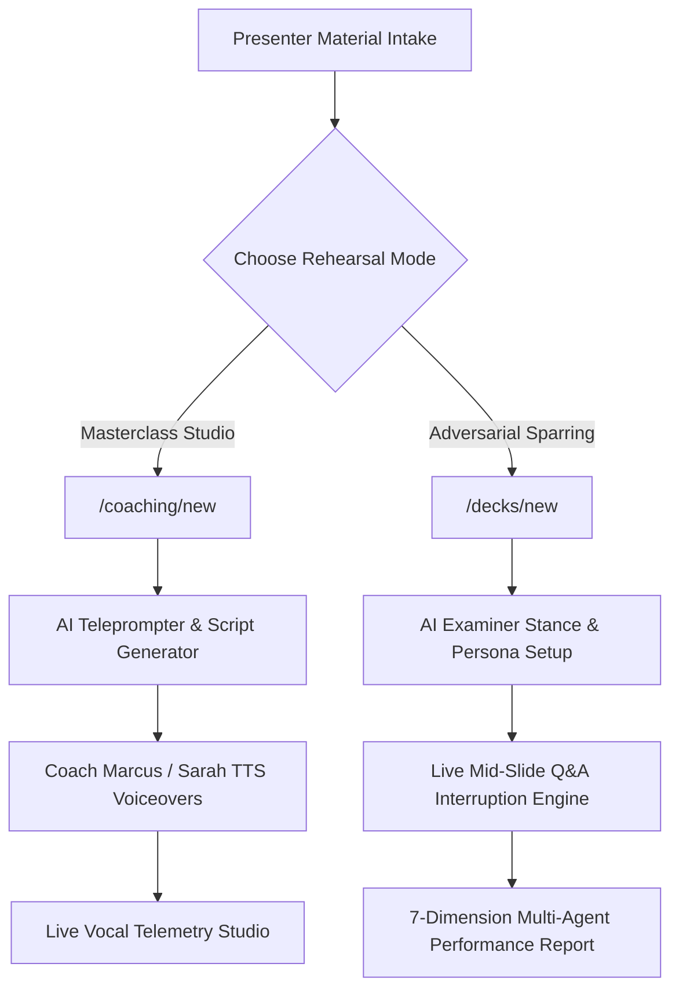

<div align="center">

# 🦈 SharkPit
### Executive Presentation Defense & Masterclass AI Delivery Studio

[](https://nextjs.org/)
[](https://www.typescriptlang.org/)
[](https://cartesia.ai/)
[](https://tailwindcss.com/)
[](https://vitest.dev/)

*Master your presentation delivery with real-time AI speechwriting, live vocal telemetry, and high-pressure adversarial panel sparring.*

[Features](#-key-capabilities) • [Dual-Mode Architecture](#-dual-mode-architecture) • [Getting Started](#-getting-started) • [Tech Stack](#-tech-stack) • [PRD Document](./PRD.md)

</div>

---

## 🎯 What is SharkPit?

**SharkPit** is an immersive, voice-first AI presentation coaching application. Whether you are a startup founder preparing for a VC seed pitch, a researcher defending a doctoral thesis, or an executive delivering a quarterly update, SharkPit gives you a 1-on-1 AI environment to refine your speech before stepping into the room.

---

## 🚀 Key Capabilities

### 1. 🎓 Dedicated Masterclass Delivery Studio (`/coaching`)
* **Slide-by-Slide AI Teleprompter**: Automatically analyzes your presentation deck and writes spoken talking points, high-impact hooks, and 15-second model pitch scripts for every slide.
* **Coach Voiceover Demonstrations**: Listen to **Coach Marcus** (*Executive Delivery Specialist*) or **Coach Sarah** (*Presentation Strategist*) read optimal slide scripts aloud via ultra-low latency TTS so you can copy their tone, speed, and emphasis.
* **Live Speech Telemetry**: Tracks real-time **Words-Per-Minute (WPM)** pacing, vocal weight explanation depth (`Overview` vs `Balanced` vs `Technical`), and presenter directive checklists.

### 2. ⚔️ Adversarial AI Panel Sparring (`/rehearse`)
* **High-Pressure Q&A Simulation**: Practice under realistic pressure. The AI examiner panel listens to your presentation and interrupts at critical moments with challenging follow-up questions.
* **Customizable Examiner Stances**: Choose between **Rigorous** (probes assumptions and metrics hard) and **Supportive** (guided feedback while testing understanding).
* **Audience Persona Simulation**: Rehearse against tailored personas including **VC Investors**, **Executive Board**, **Academic Professors**, **Hackathon Judges**, and **Recruiters**.

### 3. 📊 Multi-Agent Performance Analytics (`/reports`)
* **7-Dimension Evaluation Breakdown**: Evaluates your performance across *Clarity*, *Confidence*, *Technical Rigor*, *Storytelling*, *Persuasiveness*, *Conciseness*, and *Verbatim Reading Detection*.
* **Transcript Timeline & Interruption Log**: Review exactly where your pitch faltered, what questions were asked, and personalized recommendation action items for your next run.

### 4. 🖼️ High-Fidelity OpenXML Deck Extraction
* **Native PowerPoint (.pptx) & PDF Parser**: Extracts slide layouts, typography, shapes, and image assets in high resolution, preserving text evidence for AI examiner evaluation.

---

## 🏛️ Dual-Mode Architecture



---

## 🛠️ Tech Stack

* **Core Framework**: [Next.js 16](https://nextjs.org/) (App Router & Turbopack), [React 19](https://react.dev/)
* **Language & Typing**: [TypeScript](https://www.typescriptlang.org/) (Strict Mode)
* **Styling & Components**: [Tailwind CSS](https://tailwindcss.com/), [Shadcn UI](https://ui.shadcn.com/), [Framer Motion](https://www.framer.com/motion/), [Lucide Icons](https://lucide.dev/)
* **State Management**: [Zustand](https://github.com/pmndrs/zustand)
* **Voice & AI Engines**:
  * **Text-to-Speech (TTS)**: [Cartesia AI API](https://cartesia.ai/) (Hyper-realistic male/female voice models)
  * **Speech-to-Text (ASR)**: Web Speech API & Whisper Integration
  * **LLM Engine**: ZAI GLM-4 Flash / Groq LLM integration
* **Database & ORM**: SQLite, [Prisma ORM](https://www.prisma.io/)
* **Test Suite**: [Vitest](https://vitest.dev/) (100% test coverage with 435+ unit tests)

---

## 💻 Getting Started

### Prerequisites

* Node.js v18.0.0 or higher
* npm or bun package manager

### Environment Setup

Create a `.env` file in the root directory:

```env
DATABASE_URL="file:./db/custom.db"
GROQ_API_KEY="your-groq-api-key"
CARTESIA_API_KEY="your-cartesia-api-key"
ZAI_API_KEY="your-zai-api-key"
```

### Installation & Launch

1. **Install dependencies**:
   ```bash
   npm install
   ```

2. **Initialize database schema**:
   ```bash
   npx prisma db push
   ```

3. **Run Vitest test suite**:
   ```bash
   npx vitest run
   ```

4. **Start local development server**:
   ```bash
   npm run dev
   ```

5. Open **[http://localhost:3000](http://localhost:3000)** in your browser.

---

## 📁 Repository Structure

```
├── src/
│   ├── app/                    # Next.js App Router endpoints & routes
│   │   ├── api/                # REST API routes (/coaching/script, /session, /tts, /upload-presentation)
│   │   ├── coaching/           # Masterclass Coaching routes (/coaching/new, /coaching/[sessionId])
│   │   ├── decks/              # Presentation intake routes (/decks/new)
│   │   ├── rehearse/           # Live Sparring room routes (/rehearse/[sessionId])
│   │   └── reports/            # Analytical report routes (/reports/[sessionId])
│   ├── components/             # Reusable UI components & Shadcn primitives
│   ├── features/               # Encapsulated feature modules
│   │   ├── coaching/           # Masterclass studio components, types, and stores
│   │   ├── defense/            # Rehearsal setup, slide parser, and report views
│   │   └── simulator/          # Live simulation audio controllers & telemetry
│   └── lib/                    # Store definitions, voice engines, and API clients
├── PRD.md                      # Detailed Product Requirements Document
└── vitest.config.ts            # Vitest unit test configuration
```

---

## 📄 Documentation

For detailed product specifications, target user personas, functional requirements, and architecture design, please view the [Product Requirements Document (PRD.md)](./PRD.md).

---

<div align="center">
Built with ❤️ for presenters, founders, researchers, and executive speakers worldwide.
</div>
